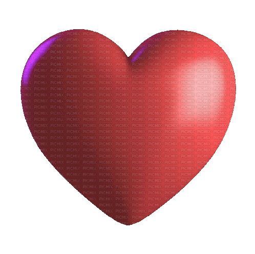

<link href = "CSS/readme.css">

<!-- The head table: gifs + banner -->
<table align = "center">
   <tr>
      <!-- Spaces gifs-->
      

         <a href = "https://github.com/polina-vaganova/polina-vaganova/blob/main/Materials/Space.gif">
            
            
            
            
            
            
            
            
            
            
            
            
            
            
            
            
            
            
            
            
            
            
            
            
            
            
            
            
            
            
            
            
            
            
            
         </a>
      

   </tr>

   <!-- Banner: erdogan-deniz -->
   <tr>
      
   
         <image src = "/Materials/title.png"> </image> 
      

   </tr>
   
   <!-- Text: default user from Russia -->
   <tr>
      
      

         
      

   </tr>
   
   
</table>

<!-- All stats table-->
<table height = "450px" align = "center">
   
   <!-- Streak and main launguge -->
   <tr>
      <td>
         

            
         

      </td>
      <td>
         

            
         

      </td>
   </tr>
   
   <!-- Launguages, school 21 -->
   <tr>
      <td>
         

            
         

      </td>
      <td>
         

            
         

      </td>
   </tr>
   
   <!-- Trophies -->
   <tr>
      

         
      

   </tr>
   
   <!-- Activity graph -->
   <tr>
      

         
      

   </tr>

   <!-- Activity graph -->
   <tr>
      

         
      

   </tr>
</table>

𝔸𝕓𝕠𝕦𝕥 𝕞𝕖:
* 22 years old;
* From Russia;
* Data Scientist;
* Student of University;
* Student of School 21.

🍋 𝕊𝕥𝕒𝕔𝕜 𝕥𝕠𝕠𝕝𝕤:

<table align = "center">
   <tr>
      <td width = "30%">
         
      </td>
      <td>
         
      </td>
   </tr>
</table>

<table align = "center">
   <tr>
      <!-- Spaces gifs-->
 

         <a href = "https://github.com/erdogan-deniz/erdogan-deniz/blob/main/Materials/Space.gif">
            
            
            
            
            
            
            
            
            
            
            
            
            
            
            
            
            
            
            
            
            
            
            
            
            
            
            
            
            
            
            
            
            
            
            
         </a>
      

   </tr>
</table>
